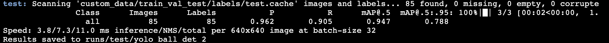

Setup
1. It is recommanded to install two separate virtual environments for ```sam2``` and ```yolov7``` 
  * For ```sam2/```, pip install pytorch first (do check compatible cuda version) before ```pip install -e ".[demo]" ```
  * For ```yolov7/```, ```pip install -r requirements.txt```
2. Read ```HawkEye_ML_project_report.pdf``` to learn about Pseudo-labelling and experiment setup and results.
2. Visit ```sam2/``` and run notebooks
3. Visit ```yolov7``` and run notebooks

Here is our benchmark, after 2 rounds of 20 epochs with only 400-600 training images.


